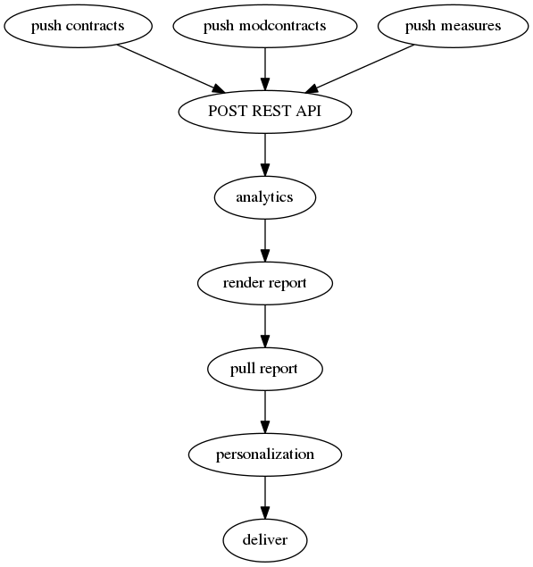

# Infoenergia internals and operation

El servei infoenergia es basa en el servei d'analítica [BeeData](http://www.beegroup-cimne.com/beedata/ "") implementat pel [BeeGroup](http://www.beegroup-cimne.com "") en el marc del projecte europeu [Empowering](http://iee-empowering.eu/en/ "").

Enllaços interessants relacionat amb IEE-Empowering:

- [Documentació](http://iee-empowering.eu/en/downloads/ "")
- [API](https://api.empowering.cimne.com/v1/docs "")
- [Source code (partial)](https://bitbucket.org/cimnebeegroup/iee-empowering/wiki/Home "")


El servei Infoenergia es divideix en:
- Procés setmanal
- API Infoenergia
- Informe e-mail
- Apartat Infoenergia oficina virtual
- Reports setmanals

## Procés setmanal

El procés setmanal inclou l'actualització de les dades disponibles per BeeData, execució de l'analítica i baixa de resultats.



1. Pujar nous contractes (SOM -> BeeData)
2. Pujar modificacions contractuals (SOM -> BeeData)
3. Pujar lectures mensuals (SOM -> BeeData)
4. Pujar lectures horàries (SOM -> BeeData)
5. Execució analítica (BeeData)
6. Baixar resultats (SOM <- BeeData)
7. Guardar resultats localment (SOM)

### Descripció

La gestió de la pujada i baixa es fa a través de la llibreria [amoniak](https://github.com/Som-Energia/amoniak "amoniak") que s'executa a partir de diferents workers que es poden visualitzar al gestor de tasques de RQ vinculats a la següents cues:

- contracts
- measures
- sips_measures

La llibreria [amoniak](https://github.com/Som-Energia/amoniak "amoniak") utilitza:

- [Empowering](https://github.com/Som-Energia/empowering ""). Implementa l'[API REST](https://api.empowering.cimne.com/v1/docs "") de comunicació amb BeeData
- Especificació [AMON](https://amee.github.io/AMON/ ""). Defineix el format JSON de les contingut de les peticions
- [ERP-empowering](https://github.com/Som-Energia/erp-empowering ""). Implementa empowering a l'ERP (gestió de dades, enviament de mails, ...)

Les dades vinculades als contractes i mesures estan gestionades i emmagatzemades per l'ERP (exceptuant horàries), i els resultats de l'analítica estan emmagatzemades pel MongoDB.

***La gestió de la pujada de lectures horàries no es realitza a través de l'API, ni amoniak, si no que es du a terme directament a través de SFTP.***

### Cues

Per cada cada una de les cues hi ha un [worker](http://python-rq.org/docs/workers/ "") vinculat que gestiona les peticions que s'encuen. La pujada i baixada de dades es fa a través d'aquestes workers.

#### contracts

Fa una cerca dels contractes vinculats a Infoenergia que explícitament no estan inhabilitats a petició dels socis. Es fa una consulta a BeeData (API) per comprovar si ha estat prèviament activat al servei.

 - Si no està activat s'extreu la informació vinculada al contracte (ERP), s'exporta al format AMON i es puja a BeeData (API POST)
 - Si està actiu i hi ha modificacions contractuals posteriors a la última data d'actualització (ERP) s'extreu la informació vinculada al contracte (ERP), s'exporta al format AMON i es puja a BeeData (API PATCH)
 
En ambdós casos s'actualitza l'[Etag](https://en.wikipedia.org/wiki/HTTP_ETag "") vinculat al contracte (ERP).

#### measures

Fa una cerca de les noves **lectures de facturació** dels comptadors vinculats als contractes actius (ERP) des de la data de la última pujada associada al comptador. S'extreu la informació vinculada a la lectura (ERP), s'exporta al format AMON i es puja a BeeData (API POST)

Posteriorment s'actualitza la data d'última lectura associada al comptador.

#### sips_measures

Fa una cerca de contractes (ERP) amb el servei Infoenergia actiu i que disposen de dades SIPS (MongoDB) anteriors a la data d'alta del contracte. S'extreu la informació vinculada a les lectures anteriors a la data d'alta (MongoDB), s'exporta al format AMON i es puja a BeeData (API PATCH)

### Operativa

Tota la operativa vinculada a la procés setmanal està implementada a [Empowering scripts](https://github.com/Som-Energia/empowering-scripts "") i instal.lada al servidor de l'ERP

#### Pujar nous contractes (SOM -> BeeData)

La pujada de contractes es fa setmanalment:

_00 1 * * 6 sh empowering-scripts/push/push_contracts.sh_

L'script afegeix una tasca a la cua **contracts** descrita anteriorment

#### Pujar modificacions contractuals (SOM -> BeeData)

Les modificacions contractuals es fan en la mateixa tasca anterior

#### Pujar lectures mensuals (SOM -> BeeData)

La pujada de lectures es fa setmanalment:

_00 4 * * 6 sh empowering-scripts/push/push_measures.sh_

L'script afegeix una tasca a la cua **measures** descrita anteriorment

La pujada de lectures des SIPS es fa setmanalment:

_45 1 * * 6 sh empowering-scripts/push/push_sips_measures.sh_

L'script afegeix una tasca a la cua **sips_measures** descrita anteriorment

#### Pujar lectures horàries (SOM -> BeeData)

La implementació està a [Empowering PUSH tg](https://github.com/Som-Energia/cchuploader ""). Permet definir el número de dies històric que es volen subministrar al BeeData utilizant la data de modificació de MongoDB de referència. El sistema extreu les dades en fitxers locals i posteriorment sincronitzac via RSYNC (SFTP) amb el servidor de BeeData.

** WARNING: Pendent de validació per part de BeeData i SOM. Posteriorment caldrà afegir la tasca al crontab pq s'executi periòdicament**

#### Guardar resultats localment (SOM)

La baixada de resultats es fa setmanalment:

_00 3 * * 7 sh empowering-scripts/get_ots/get_ots.sh_

L'script afegeix una tasca a la cua **empowering_results_pull*

## API Infoenergia

Els resultats de l'analitica descarregats en local, aixi com també l'accés a les dades horàries i la informació personal es pot fer a través de l'API infoenergia implementa a [HEMAN REST API](https://github.com/Som-Energia/heman "")


L'API esta muntada sobre Flask i permet l'accés autenticat a:

- Lectures horàries /CCHFact/<cups>/<period>
- Informació addicional dels contractes /Empowering<Building|Profile>Form<contract|cups>
- Configuració personal /EmpoweringSettingsForm/<contract>

El conjunt de serveis a l'usuari final utilitzen aquesta REST API.

Per poder fer consultes a aquesta hi ha la llibreria [https://github.com/Som-Energia/ramman](ramman "") que implementa el conjunt de mètodes per fer consultes a l'API.

## Informe e-mail

### Descripció

L'enviament dels informes està implementat dins l'ERP per tal de poder aprofitar les llibreries de generació de PDFs i l'enviament de correus electrònics.

El contingut dels informes està definit en una plantilla .mako vinculada a un plantilla de poweremail anomenada _Enviar report Empowering_.

La plantilla .mako consulta les dades personals a l'ERP i els resultats de l'anàlisi al Heman API Infoenergia.

Amb les dades i la plantilla .mako ([veure mako](https://github.com/gisce/erp/tree/developer/addons/gisce/SomEnergia/som_empowering/report "")) genera el PDF que s'enviarà amb el cos de missatge definit pel poweremail. 

### Operació

L'enviament dels informes es realitza "manualment" i està implementat a [Empowering-scripts](https://github.com/Som-Energia/empowering-scripts/tree/developer/send "").

Com que actualment no s'estan enviant els informes a tothom, la llista de contractes amb el servei d'enviament habilitat estan al .csv del directorti _data_.

L'script d'enviament que actualment s'executa manualment és _send/cli.py_.

```
python cli.py
Usage: cli.py [OPTIONS] COMMAND [ARGS]...

Options:
  --help  Show this message and exit.

Commands:
  deliver
  deliver_all
```

Si s'utiliza la comanda _deliver_ es pot indicar el fitxer amb els contractes als quals es vol enviar l'informe:

```

python cli.py deliver ../data/enabled.csv

```

L'enviament es farà als contractes que compleixin **totes** les condicions:

- Contractes de la llista en cas de la comanda _deliver_ o tots els contractes en cas de _deliver_all_
- Es disposi de resultats de l'analítica per tots els apartats de l'informe
- Informe del més anterior a la última lectura disponible. NOTA: En general correspondria a now-2month per assegurar que es disposa de dades entre dos mesos naturals.

Si l'informe s'envia correctament s'actualitzarà el log d'enviament de mails que és accessible des del contracte amb Empowering activat.


## Apartat Infoenergia oficina virtual

L'apartat de l'oficina virtual està implementat Oficina virtual (veure /src/portal/templates/portal)

```
    function loadGraphics(contract, period) % Carrega les gràfiques 
    function loadProfile(contract) % Carrega lectures horàries
    function loadPeriods(contract) % Carrega llista de períodes amb dades
    function loadForms(contract) % Carrega formularis dades personals
    function loadService(contract) % Crida la carrega de les anteriors
```

La informació s'obté a partir de les funcions d'oficina virtual i la informació accessible a través de l'API Infoenergia.

La generació de les gràfiques de l'informe es fa a través de [Empowering.js](https://github.com/Som-Energia/empowering.js ""). Javascript que fa les consultes de l'API i generar les gràfiques.

## Reports setmanals

Setmanalment s'envia un correu electrònic a sistemes@somenergia.coop amb un resum setmanal de l'activitat del servei Infoenergia:

```
Summary
  Contracts enabled: XXXX
  Contracts active: XXXX
  Delivered reports from (20XX-XX-XX) to (20XX-XX-XX): XXXX
Helpscout
  totalConversations: XXXX
  conversationsCreated: XXXX
  conversationsPerDay: XXXX
Mandrill
  Sent: XXXX
  Open: XXXX
```

L'informe s'executa setmanalment

_00 1 * * 1 sh empowering-scripts/status/runner.sh_
